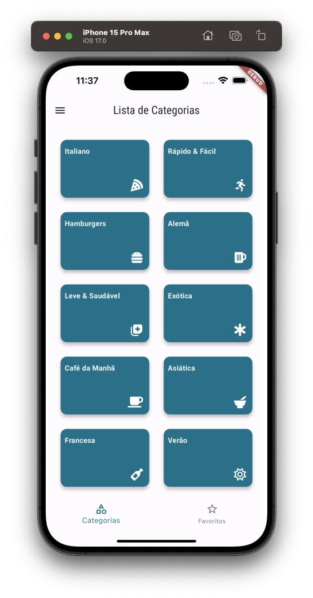
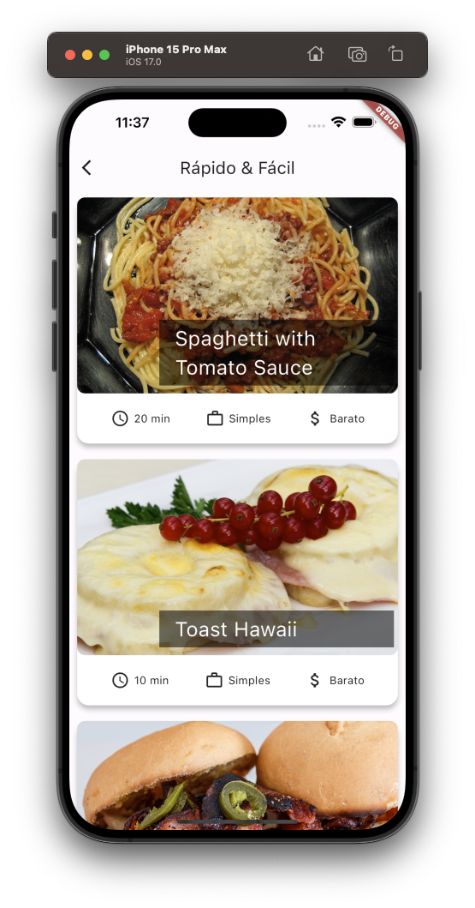
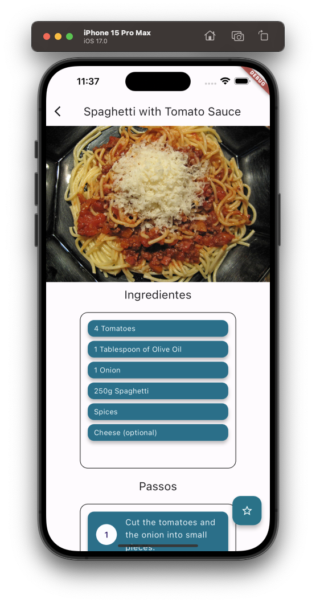
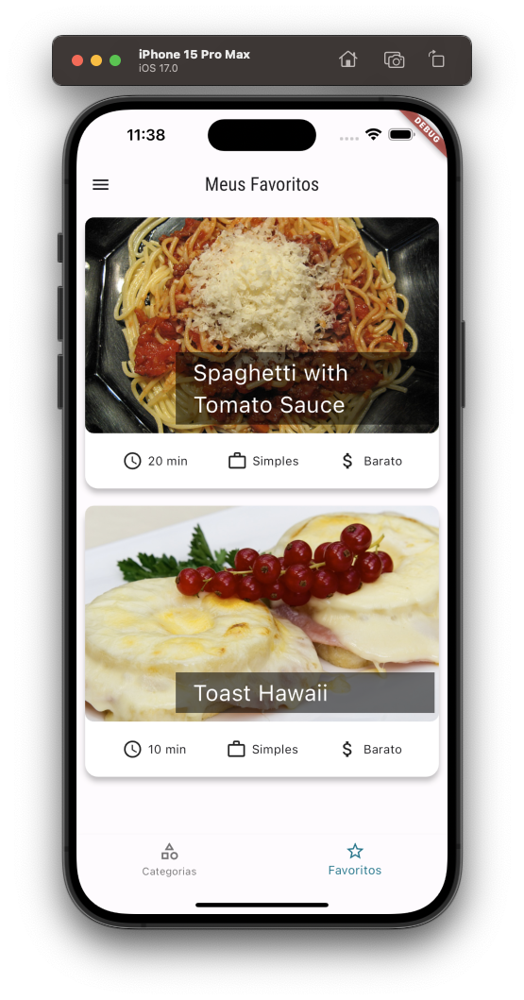
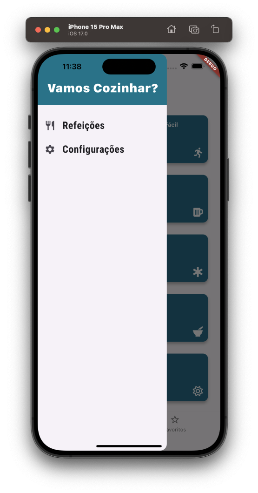
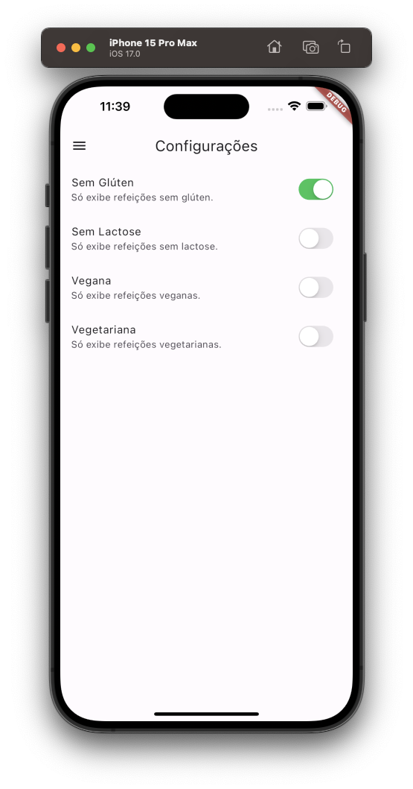

---

## Meals App

---

<div align="center">

**Language:**

[](README.md)
[](README.pt-br.md)

</div>

---
## ℹ️ About this repository
This repository's main objective is to demonstrate the application developed to train my knowledge during the Flutter course from the company [COD3R](https://www.udemy.com/course/curso-flutter/).

This project, although simple, aims to review the concepts of navigation between screens using Flutter.

---
## ⚙️ Features
This app consists of:

- List meal categories.
- List meals linked to a particular meal category.
- Filter meals based on user-defined settings.
- Manage meals marked as favorites by the user.

---
## 👁️ Preview
<h1 align="center">



</h1>

<h1 align="center">



</h1>

---
## 🧪 Technologies
This project was developed using the following technologies:

- [Flutter (v3.16.2)](https://docs.flutter.dev/)
- [Dart (v3.2.2)](https://dart.dev/)
- [Intl](https://pub.dev/packages/intl)
- [Google_Fonts](https://pub.dev/packages/google_fonts)
- [Font Awesome Flutter](https://pub.dev/packages/font_awesome_flutter)

---
## ⚡ Installing

First clone this project using:

```bash
  git clone https://github.com/GoedertDalmolin/meals.git
  cd meals
```

Finally, with flutter installed on your machine, run the following command:

```bash
  flutter run
```

---
</> Developed by [GoedertDalmolin](https://github.com/GoedertDalmolin) 👋
---
