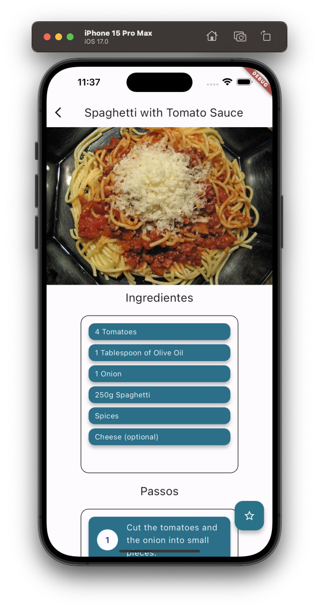
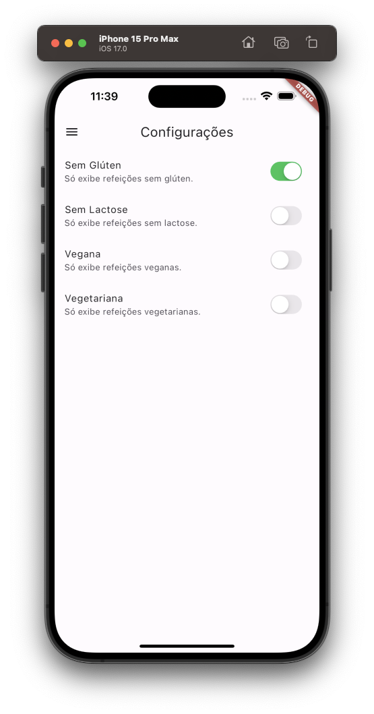

---

## Meals App

---

<div align="center">

**Language:**

[](README.md)
[](README.pt-br.md)

</div>

---
## ℹ️ Sobre este repositório
O objetivo principal deste repositório é demonstrar o aplicativo desenvolvido para treinar meus conhecimentos durante o curso de Flutter da empresa [COD3R](https://www.udemy.com/course/curso-flutter/).

Este projeto, apesar de simples, tem como objetivo revisar os conceitos de navegação entre telas utilizando Flutter.

---
## ⚙️ Funcionalidades
Este aplicativo consiste em:

- Listar categorias de refeições.
- Listar as refeições vinculadas a uma categoria específica de refeições.
- Filtre as refeições com base nas configurações definidas pelo usuário.
- Gerenciar refeições marcadas como favoritas pelo usuário.

---
## 👁️ Pré-visualização
<h1 align="center">



</h1>

<h1 align="center">



</h1>

---
## 🧪 Tecnologias
Este projeto foi desenvolvido usando as seguintes tecnologias:

- [Flutter (v3.16.2)](https://docs.flutter.dev/)
- [Dart (v3.2.2)](https://dart.dev/)
- [Intl](https://pub.dev/packages/intl)
- [Google_Fonts](https://pub.dev/packages/google_fonts)
- [Font Awesome Flutter](https://pub.dev/packages/font_awesome_flutter)

---
## ⚡ Instalação

Primeiramente clone este projeto usando:

```bash
  git clone https://github.com/GoedertDalmolin/meals.git
  cd meals
```

Por fim, com o flutter instalado em sua maquina, execute o seguinte comando:

```bash
  flutter run
```

---
</> Desenvolvido por [GoedertDalmolin](https://github.com/GoedertDalmolin) 👋
---